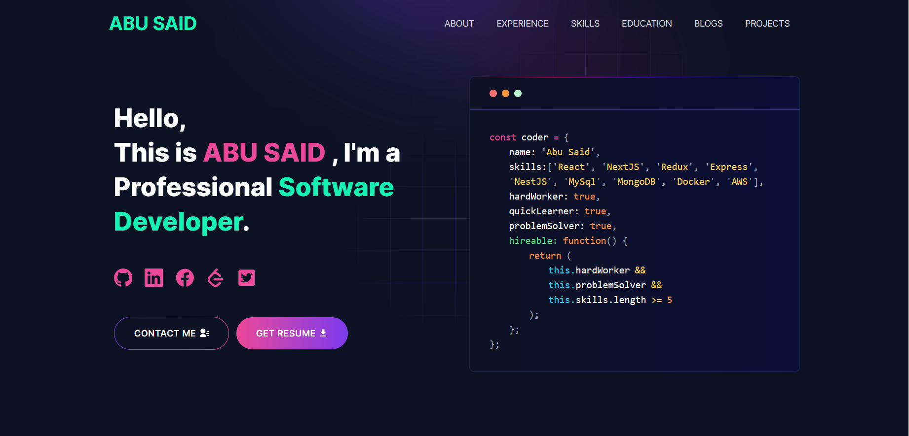

# 🚀 Saksham Yadav - Developer Portfolio

A modern, responsive portfolio website built with **Next.js 14** and **Tailwind CSS**, showcasing the professional profile, projects, and skills of Saksham Yadav, a Software Developer based in Santa Clara, California.

[](https://nextjs.org/)
[](https://reactjs.org/)
[](https://tailwindcss.com/)
[](https://vercel.com/)

## 🌐 Live Demo

**Portfolio Website**: [https://portfolio-gold-zeta-51.vercel.app/](https://portfolio-gold-zeta-51.vercel.app/)

## 📸 Preview



## ✨ Features

### 🎨 **Modern Design**
- **Fully Responsive** - Seamless experience across desktop, tablet, and mobile devices
- **Dark Theme** - Professional dark mode design with smooth animations
- **Clean UI/UX** - Intuitive navigation and user-friendly interface

### 🛠️ **Technical Features**
- **Server-Side Rendering (SSR)** - Next.js 14 with App Router for optimal performance
- **SEO Optimized** - Meta tags, structured data, and performance optimization
- **Fast Loading** - Optimized images and lazy loading
- **Progressive Web App** ready architecture

### 📱 **Interactive Sections**
- **Hero Section** - Dynamic introduction with call-to-action
- **About Me** - Detailed professional background and personal story
- **Experience Timeline** - Career progression with company details
- **Skills Showcase** - Technical skills with proficiency indicators and animations
- **Projects Portfolio** - Featured projects with live demos and source code links
- **Education** - Academic background and certifications
- **Contact Form** - Functional contact form with EmailJS integration

### 🚀 **Performance & Accessibility**
- **Lighthouse Score**: 95+ for Performance, Accessibility, and SEO
- **Web Vitals Optimized** - Core Web Vitals compliance
- **Accessible Design** - WCAG guidelines compliance

## 🛠️ Tech Stack

| Category | Technology |
|----------|------------|
| **Frontend Framework** | [Next.js 14](https://nextjs.org/) |
| **Styling** | [Tailwind CSS](https://tailwindcss.com/) |
| **Language** | JavaScript (ES6+) |
| **UI Library** | [React 18](https://reactjs.org/) |
| **Animations** | [Lottie React](https://www.npmjs.com/package/lottie-react) |
| **Icons** | [React Icons](https://react-icons.github.io/react-icons/) |
| **Email Service** | [EmailJS](https://www.emailjs.com/) |
| **Marquee Effects** | [React Fast Marquee](https://www.npmjs.com/package/react-fast-marquee) |
| **Notifications** | [React Toastify](https://fkhadra.github.io/react-toastify/) |
| **Deployment** | [Vercel](https://vercel.com/) |
| **Development Tools** | ESLint, PostCSS, Autoprefixer |

## 📋 Prerequisites

Ensure you have the following installed on your system:

- **Node.js** (version 16.0 or higher) - [Download here](https://nodejs.org/)
- **Git** - [Download here](https://git-scm.com/)
- **npm** or **yarn** package manager

## ⚡ Getting Started

### 1. Clone the Repository

```bash
git clone https://github.com/Sakshamyadav19/developer-portfolio.git
cd developer-portfolio
```

### 2. Install Dependencies

```bash
npm install
# or
yarn install
# or
pnpm install
```

### 3. Environment Configuration

Copy the example environment file and configure your settings:

```bash
cp .env.example .env.local
```

**Required Environment Variables:**
```env
# EmailJS Configuration
NEXT_PUBLIC_EMAILJS_SERVICE_ID=your_service_id
NEXT_PUBLIC_EMAILJS_TEMPLATE_ID=your_template_id
NEXT_PUBLIC_EMAILJS_PUBLIC_KEY=your_public_key

# Google reCAPTCHA (optional)
NEXT_PUBLIC_RECAPTCHA_SITE_KEY=your_recaptcha_site_key
```

### 4. Run Development Server

```bash
npm run dev
# or
yarn dev
# or
pnpm dev
```

Open [http://localhost:3000](http://localhost:3000) in your browser to see the result.

## 🗂️ Project Structure

```
developer-portfolio/
├── app/
│   ├── api/                 # API routes
│   ├── blog/               # Blog pages
│   ├── components/         # React components
│   │   └── homepage/      # Homepage sections
│   ├── css/               # Custom styles
│   ├── layout.js          # Root layout
│   └── page.js            # Home page
├── public/                # Static assets
│   └── image/            # Images and icons
├── utils/
│   └── data/             # Data configuration files
│       ├── personal-data.js
│       ├── projects-data.js
│       ├── skills.js
│       ├── experience.js
│       ├── educations.js
│       └── contactsData.js
├── .env.example          # Environment variables template
├── next.config.js        # Next.js configuration
├── tailwind.config.js    # Tailwind CSS configuration
└── package.json          # Dependencies and scripts
```

## 🔧 Customization Guide

### 📝 Personal Information

Edit your personal details in `utils/data/personal-data.js`:

```javascript
export const personalData = {
  name: \"Your Full Name\",
  designation: \"Your Professional Title\",
  description: \"Brief description about yourself...\",
  email: \"your-email@example.com\",
  phone: \"+1234567890\",
  address: \"Your Location\",
  github: \"https://github.com/yourusername\",
  linkedIn: \"https://linkedin.com/in/yourprofile\",
  twitter: \"https://twitter.com/yourusername\",
  resume: \"https://link-to-your-resume.pdf\"
}
```

### 💼 Projects Portfolio

Update your projects in `utils/data/projects-data.js`:

```javascript
export const projectsData = [
  {
    id: 1,
    name: 'Project Name',
    description: 'Project description...',
    tools: ['React', 'Node.js', 'MongoDB'],
    code: 'https://github.com/username/repo',
    demo: 'https://your-demo-link.com',
    image: '/path-to-project-image.jpg'
  },
  // Add more projects...
];
```

### 🎯 Skills & Technologies

Modify your skills in `utils/data/skills.js` to showcase your expertise.

### 💼 Work Experience

Update your professional experience in `utils/data/experience.js`.

### 🎓 Education

Add your educational background in `utils/data/educations.js`.

## 📦 Available Scripts

| Command | Description |
|---------|-------------|
| `npm run dev` | Start development server |
| `npm run build` | Create optimized production build |
| `npm start` | Start production server |
| `npm run lint` | Run ESLint for code quality checks |

## 🎨 Styling & Theming

### Tailwind CSS Configuration

The project uses a custom Tailwind configuration with:

- **Custom Color Palette** - Professional dark theme colors
- **Typography** - Custom font families and sizes
- **Animations** - Smooth transitions and hover effects
- **Responsive Breakpoints** - Mobile-first design approach

Modify styling in `tailwind.config.js` and `app/css/` directory.

### Component Structure

Each homepage section is a separate component located in `app/components/homepage/`:

- `hero-section.js` - Landing section with introduction
- `about.js` - About me section
- `experience.js` - Professional experience timeline
- `skills.js` - Technical skills showcase
- `projects.js` - Projects portfolio
- `education.js` - Educational background
- `contact.js` - Contact form and information

## 🚀 Deployment

### Deploy on Vercel (Recommended)

1. **Fork/Clone** this repository
2. **Push** your customized code to GitHub
3. **Connect** your repository to [Vercel](https://vercel.com/)
4. **Configure** environment variables in Vercel dashboard
5. **Deploy** with automatic CI/CD

### Alternative Deployment Options

- **Netlify**: Compatible with static export
- **GitHub Pages**: Requires static export configuration
- **Self-hosted**: Use `npm run build` and serve the `dist` folder

## 📊 Performance Metrics

- **Lighthouse Score**: 95+ across all metrics
- **First Contentful Paint**: < 2s
- **Largest Contentful Paint**: < 3s
- **Time to Interactive**: < 4s
- **Cumulative Layout Shift**: < 0.1

## 🤝 Contributing

Contributions, issues, and feature requests are welcome!

1. **Fork** the repository
2. **Create** your feature branch (`git checkout -b feature/AmazingFeature`)
3. **Commit** your changes (`git commit -m 'Add some AmazingFeature'`)
4. **Push** to the branch (`git push origin feature/AmazingFeature`)
5. **Open** a Pull Request

### Development Guidelines

- Follow the existing code style and structure
- Write meaningful commit messages
- Test your changes thoroughly
- Update documentation as needed

## 📄 License

This project is open source and available under the **MIT License**.

## 👨‍💻 About the Developer

**Saksham Yadav** - Software Developer

- 🌐 **Portfolio**: [portfolio-gold-zeta-51.vercel.app](https://portfolio-gold-zeta-51.vercel.app/)
- 💼 **LinkedIn**: [saksham-yadav-133978182](https://www.linkedin.com/in/saksham-yadav-133978182/)
- 🐙 **GitHub**: [Sakshamyadav19](https://github.com/Sakshamyadav19)
- 📧 **Email**: sakshamyadavpune@gmail.com
- 📍 **Location**: Santa Clara, California

---

## 🙏 Acknowledgments

- Thanks to the **Next.js** team for the amazing framework
- **Tailwind CSS** for the utility-first CSS framework
- **Vercel** for seamless deployment and hosting
- **Open source community** for the incredible tools and libraries

---

### ⭐ Show Your Support

If this portfolio template helped you create an awesome portfolio, please give it a **star** ⭐!

**Happy Coding!** 🚀